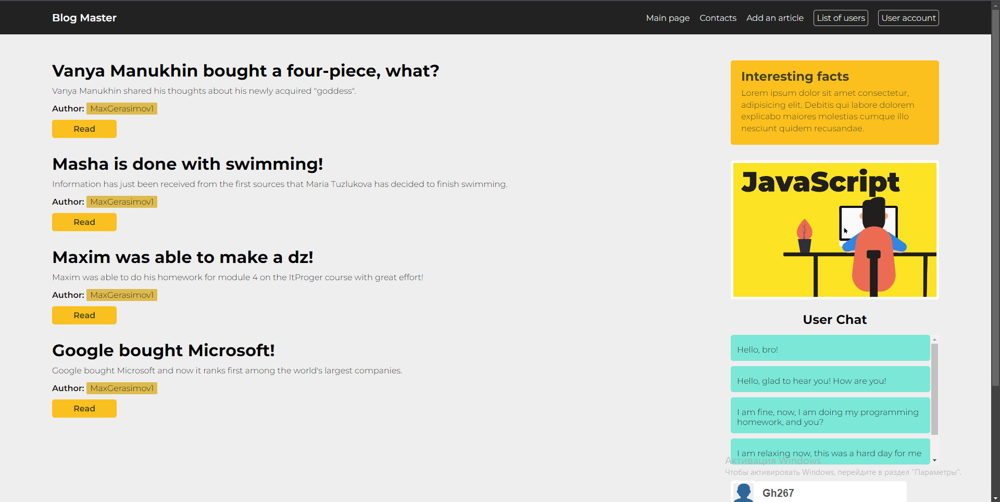
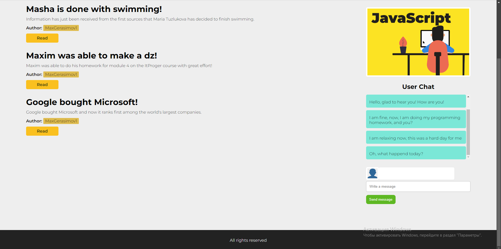
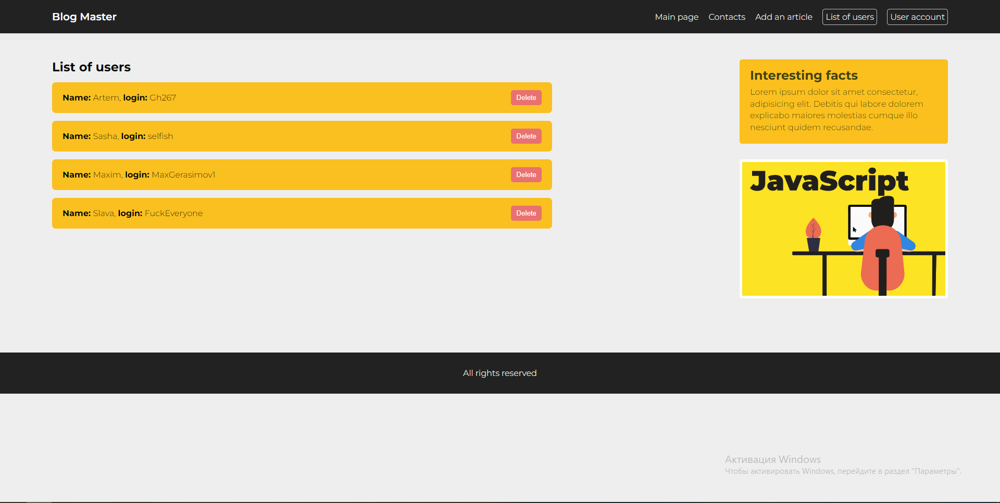
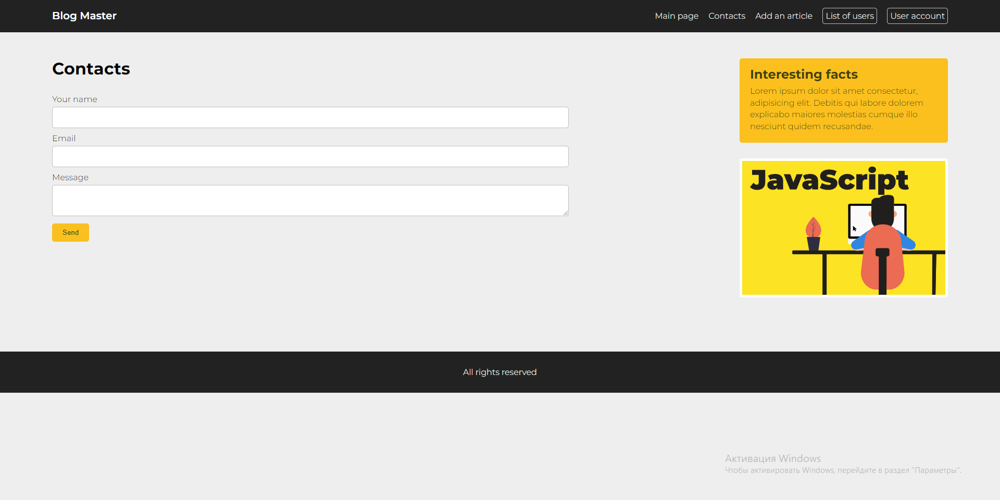
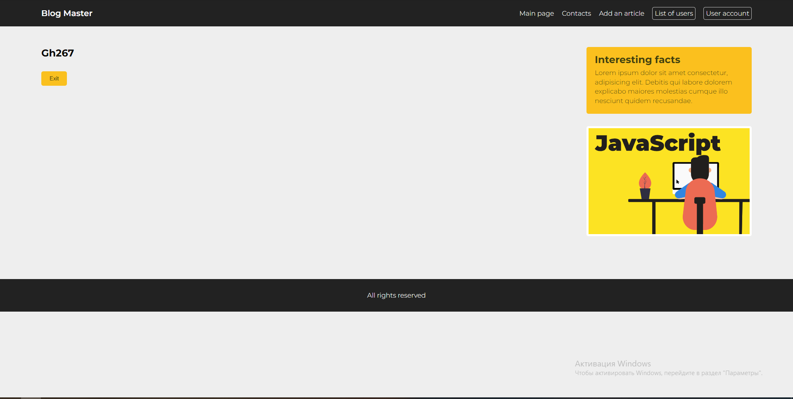
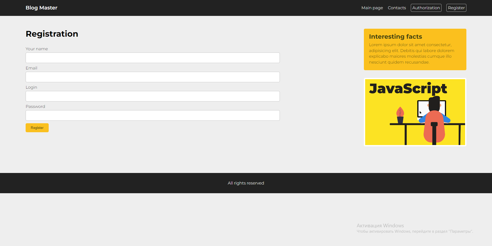

# Данный проект - веб-сайт, построенный на основе чистого php.

Этот проект реализован без использования MVC схемы проектирования и ООП, однако в нём пристствуют следующие элементы:
1. Главная страница, на которой реализован следующий функционал:
    * Вывод статей, опубликованные пользователями(с выводом автора и ссылки для полного прочтения статьи)
    * Статический вывод блока с картинкой и интересным фактом
    * Пользовательский чат(доступен только для авторизованных пользователей)
2. Страница контактов для обратной связи с поддержкой
3. Страница авторизации пользователя
4. Страница регистрации пользователя

**Если пользователь авторизован, то ему будут доступны следующие функции на сайте:**
1. Личный кабинет пользователя
2. Список всех зарегистрированных пользователей на сайте(скорее администраторская функция)
3. Добавление новой статьи на сайте
4. Аналогичные страница контаков(для связи с поддержкой) и главная страница

### Фотографии реализации данного веб-сайта

------
Таким образом, данный сайт реализован на основе чистого php, имеет достаточно хороший функционал для пользования и красивый дизайн.