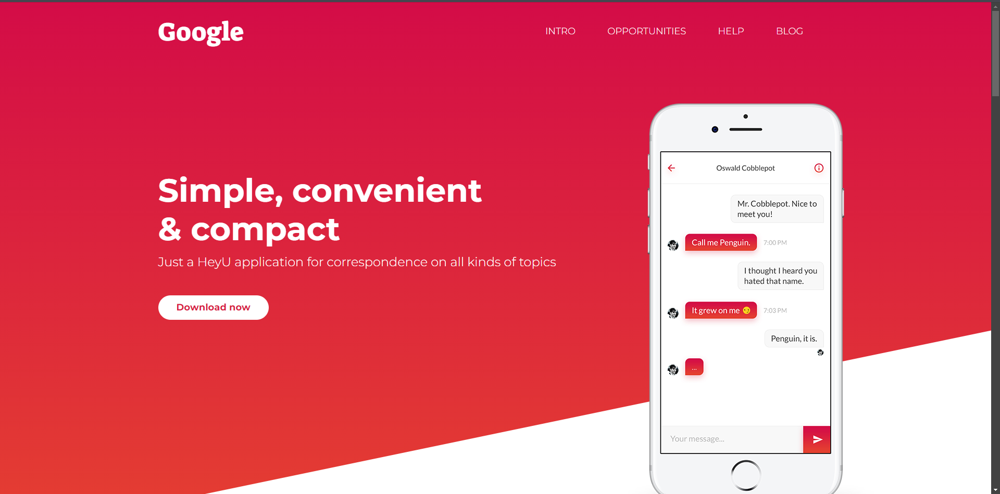
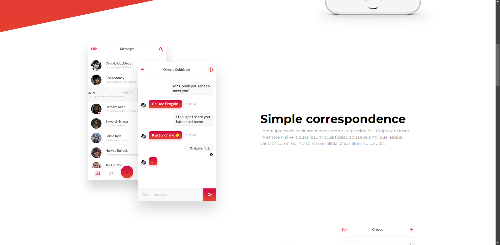
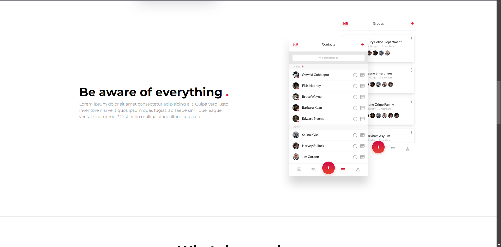
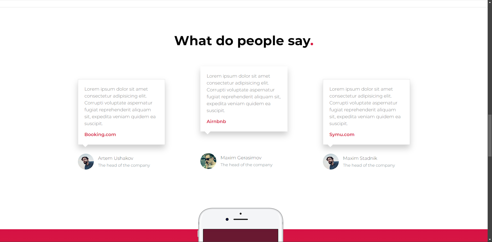
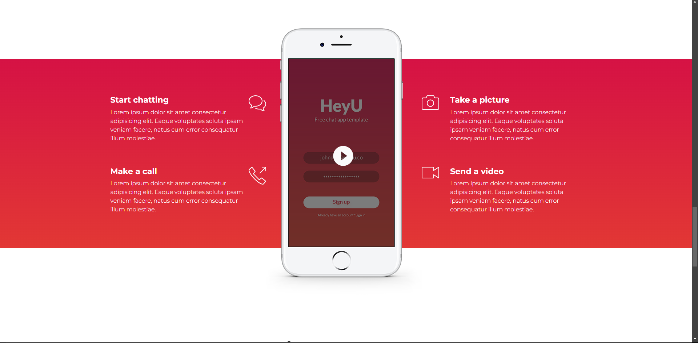
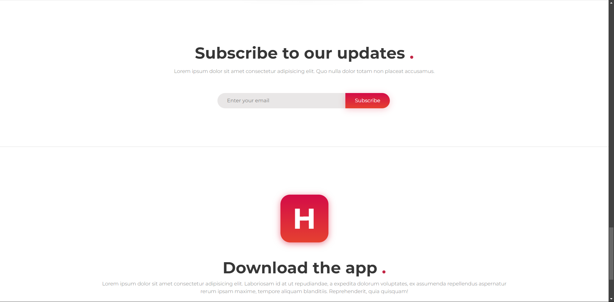
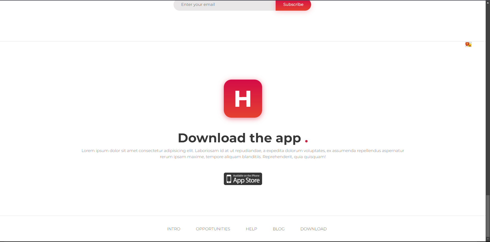

# Это мой первый созданный проект.
## В этом проекте я заверстал сайт по определённому шаблону.

**В этом проекте я использовал следующие технологии**:
1. HTML
2. CSS
3. JS
4. GULP
5. BOOTSTRAP

Данный проект не выделяется отличительной сложностью, однако показывает моё умение верстать сайты!

**Фотографии реализации данного веб-сайта:**

